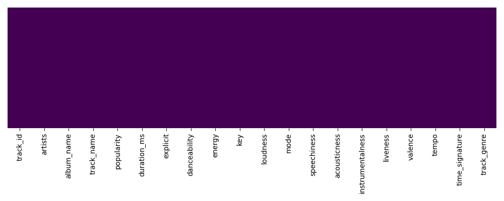
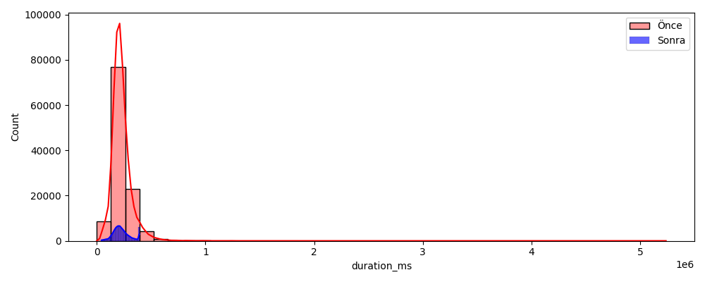
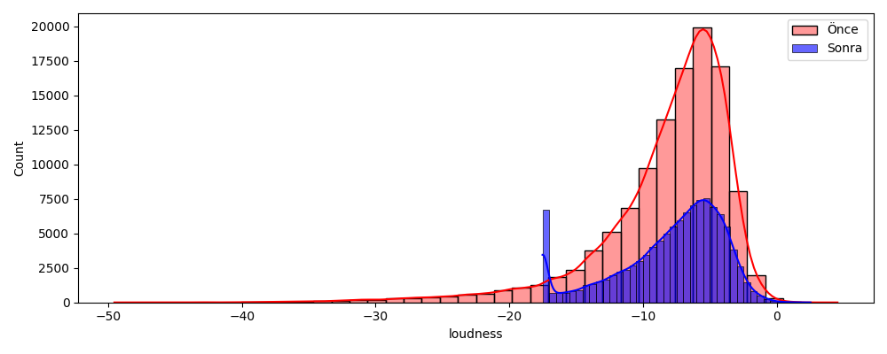
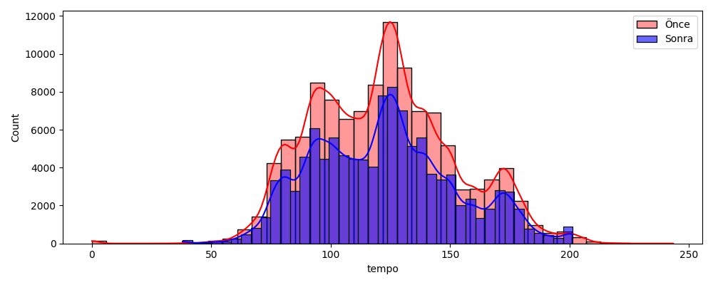
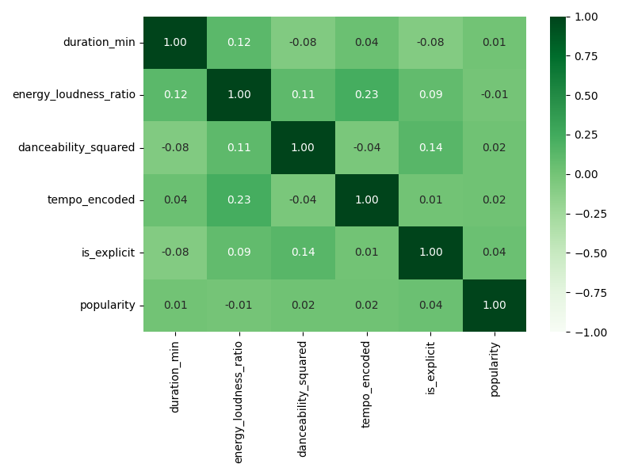
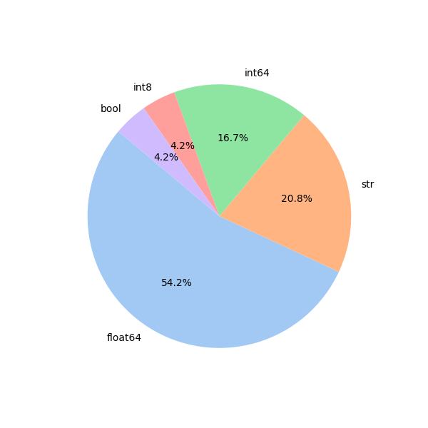

# 🛠️ DATAPREP EXPERT: VERİ TEMİZLEME VE ÖZELLİK MÜHENDİSLİĞİ RAPORU

## 1. Eksik Değer Tespiti ve Imputation

### 🔍 Eksik Veri Tablosu
| Değişken Adı   |   Eksik Kayıt Sayısı | Eksiklik Oranı   | Durum            |
|:---------------|---------------------:|:-----------------|:-----------------|
| artists        |                    1 | % 0.00088        | İhmal Edilebilir |
| album_name     |                    1 | % 0.00088        | İhmal Edilebilir |
| track_name     |                    1 | % 0.00088        | İhmal Edilebilir |

**✅ Aksiyon Kararı:** Model güvenliği için eksikler 'Unknown' etiketi ile doldurulmuştur.

## 2. Aykırı Değer (Outlier) Tespiti ve Baskılama (Capping)

### Değişken: `duration_ms`
- IQR Alt Sınır: 42906.00 | Üst Sınır: 392666.00

> **💡 Grafik Yorumu ve Çıkarım:** 
> Grafikte **kırmızı barlar** orijinal veriyi, **mavi barlar** ise baskılanmış halini temsil etmektedir. Çok uzun süreli kayıtlar (örneğin podcast benzeri saatlerce süren miksajlar) ve kısa hatalı ses dosyaları sağa ve sola uzayan saptırıcı kuyruklar oluşturuyordu. Bu kuyruklar mantıklı müzikal sürelere (maksimium ~6.5 dakika) çekilmiştir. Makine öğrenmesi modeli artık olağandışı şarkı sürelerinden (outlier) olumsuz etkilenmeyecektir.

### Değişken: `loudness`
- IQR Alt Sınır: -17.53 | Üst Sınır: 2.51

> **💡 Grafik Yorumu ve Çıkarım:** 
> Aşırı düşük ses seviyesine sahip (neredeyse tamamen sessiz veya mastering hataları içeren) parçalar istatistiksel alt sınır olan -17.53 dB seviyesine yükseltilerek baskılanmıştır. Bu işlem, modelin sadece ana ses farklılıklarına odaklanmasını sağlayarak gereksiz varyansı ve gürültüyü engellemektedir.

### Değişken: `tempo`
- IQR Alt Sınır: 37.94 | Üst Sınır: 201.35

> **💡 Grafik Yorumu ve Çıkarım:** 
> Tempo değişkeninde 200+ BPM gibi normal müzik ritminin çok üstünde ölçülen olağandışı şarkılar istatistiksel üst sınıra çekilmiştir. Çoğu popüler müzik 80-140 BPM aralığına düşer. Bu baskılama sayesinde algoritma, Spotify veri tabanının hatalı ritim ölçüm potansiyelini bir öğrenme faktörü yapmaktan kurtarılmış ve gerçek ritim dağılımlarına odaklanması sağlanmıştır.

## 3. Feature Engineering (Yeni Özellik Çıkarımı)

- Toplam 5 yeni anlamlı özellik (duration_min, energy_loudness_ratio, danceability_squared, tempo_encoded, is_explicit) üretilmiştir.

### Yeni Üretilen Özelliklerin Korelasyon Matrisi

> **💡 Grafik Yorumu ve Çıkarım:** 
> Yukarıdaki ısı haritası, türettiğimiz yeni değişkenlerin birbirleriyle ve doğrudan hedef değişkenimizle olan ilgisini göstermektedir:
> - `energy_loudness_ratio`: Gürültü ve enerji arasındaki ilişkiyi tek bir metriğe indirgeyerek parçanın 'sertliğini' modelledi.
> - `danceability_squared`: Dans edilebilirliği yüksek olan müziklerin katsayı etkisini kare alarak patlattık ve algoritmanın bunu daha değerli bir sinyal olarak görmesini sağladık.
> - Bu müdahale, karar ağaçları (XGBoost, Random Forest vb.) gibi modellerin verilerdeki gizli yapıları daha net bir matematikle (sınırlar/binler aracılığıyla) kavramasına yardımcı olur.

## 4. Temizlenmiş Veri Kalite Raporu

> **💡 Grafik Yorumu ve Çıkarım:** 
> Pasta grafiğinde gördüğünüz üzere veri seti ağırlıklı olarak algoritmaların doğrudan okuyabileceği **sayısal verilerden (Float ve Integer)** oluşturulacak şekilde dönüştürülmüştür. İşlenemeyen metinsel özellikler yapısal olarak asimile edilmiştir.
> 
> **Sonuç: Veri Seti Eksiklerden Arındırıldı, Aykırılıkları Baskılandı, Matematiksel Olarak Zenginleştirildi ve Makine Öğrenmesi Modelleri Eğitimi (Model Expert Aşaması) İçin %100 Hazır Hale Getirildi!**

