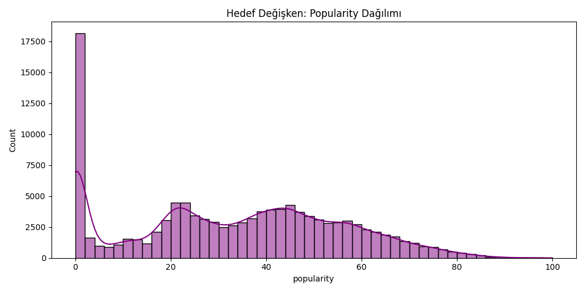
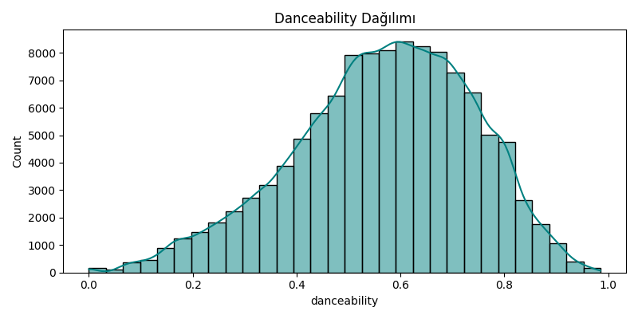
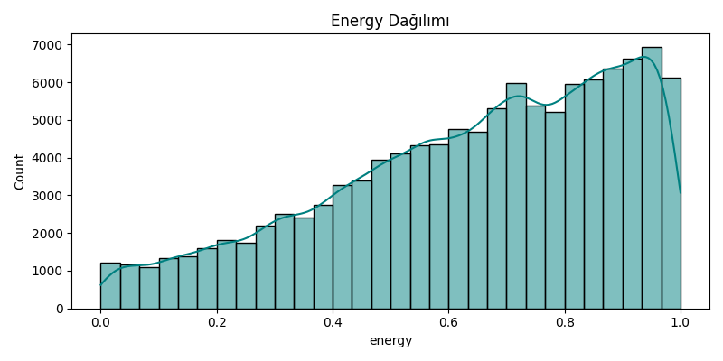
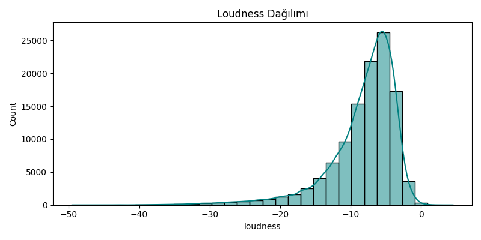
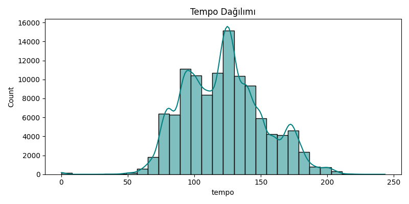
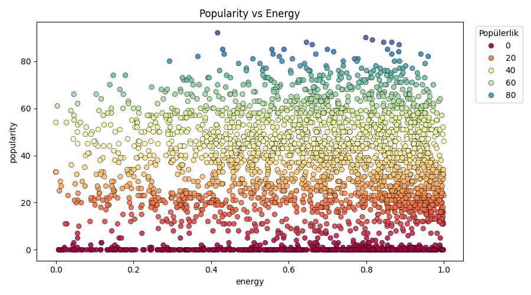
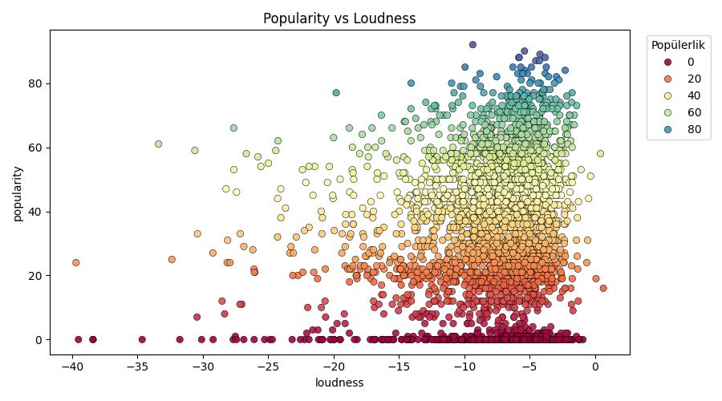
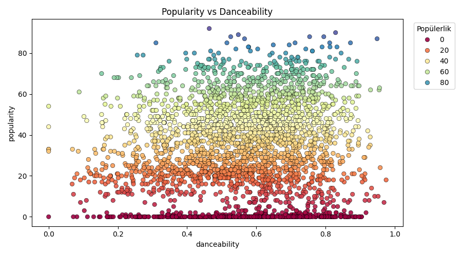
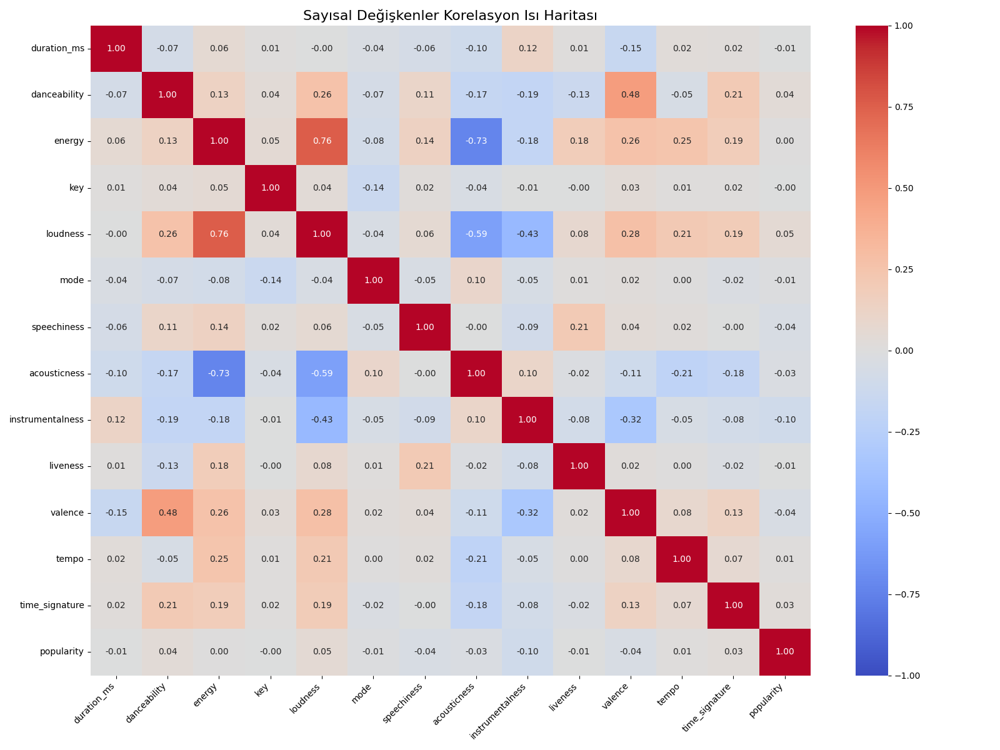

# 📊 DETAYLI VE GÖRSEL EDA NİHAİ RAPORU

> **NOT:** Tüm figürler (grafikler), tablolar ve analiz komutlarının detaylı açıklamaları/elde edilen bulgular sunum dokümanı içerisine gömülmüştür.

## 🚀 PHASE 1: VERİYE GENEL BAKIŞ (DATA OVERVIEW)

### 1. Veri Boyutu (`df.shape` Analizi)
- **Toplam Satır (Gözlem) Sayısı:** 114000
- **Toplam Sütun (Değişken) Sayısı:** 20

**❓ Ne İşe Yarar?** 
`df.shape` komutu verinin genel hacmini, elimizde kaç adet satır ve sütun olduğunu gösterir.

**💡 Elde Edilen Bilgi:** 
Verimiz oldukça büyük (114000 satır). Bu hacim, makine öğrenimi modelleri için son derece yeterlidir, ancak eğitim süreçlerinde donanım gücüne daha çok ihtiyaç duyulacağını gösterir.

### 2. Verinin İlk 5 Satırı (`df.head()` Analizi)
| track_id               | artists                | album_name                                             | track_name                 |   popularity |   duration_ms | explicit   |   danceability |   energy |   key |   loudness |   mode |   speechiness |   acousticness |   instrumentalness |   liveness |   valence |   tempo |   time_signature | track_genre   |
|:-----------------------|:-----------------------|:-------------------------------------------------------|:---------------------------|-------------:|--------------:|:-----------|---------------:|---------:|------:|-----------:|-------:|--------------:|---------------:|-------------------:|-----------:|----------:|--------:|-----------------:|:--------------|
| 5SuOikwiRyPMVoIQDJUgSV | Gen Hoshino            | Comedy                                                 | Comedy                     |           73 |        230666 | False      |          0.676 |   0.461  |     1 |     -6.746 |      0 |        0.143  |         0.0322 |           1.01e-06 |     0.358  |     0.715 |  87.917 |                4 | acoustic      |
| 4qPNDBW1i3p13qLCt0Ki3A | Ben Woodward           | Ghost (Acoustic)                                       | Ghost - Acoustic           |           55 |        149610 | False      |          0.42  |   0.166  |     1 |    -17.235 |      1 |        0.0763 |         0.924  |           5.56e-06 |     0.101  |     0.267 |  77.489 |                4 | acoustic      |
| 1iJBSr7s7jYXzM8EGcbK5b | Ingrid Michaelson;ZAYN | To Begin Again                                         | To Begin Again             |           57 |        210826 | False      |          0.438 |   0.359  |     0 |     -9.734 |      1 |        0.0557 |         0.21   |           0        |     0.117  |     0.12  |  76.332 |                4 | acoustic      |
| 6lfxq3CG4xtTiEg7opyCyx | Kina Grannis           | Crazy Rich Asians (Original Motion Picture Soundtrack) | Can't Help Falling In Love |           71 |        201933 | False      |          0.266 |   0.0596 |     0 |    -18.515 |      1 |        0.0363 |         0.905  |           7.07e-05 |     0.132  |     0.143 | 181.74  |                3 | acoustic      |
| 5vjLSffimiIP26QG5WcN2K | Chord Overstreet       | Hold On                                                | Hold On                    |           82 |        198853 | False      |          0.618 |   0.443  |     2 |     -9.681 |      1 |        0.0526 |         0.469  |           0        |     0.0829 |     0.167 | 119.949 |                4 | acoustic      |

**❓ Ne İşe Yarar?** 
`df.head()` verinin en başındaki ilk örnek satırları doğrudan görmemizi sağlar. Böylece format algısını, tarih veya metinlerin doğru düzende yüklenip yüklenmediğini anlarız.

**💡 Elde Edilen Bilgi:** 
Özellikle özellik (feature) isimleri ve içeriklerinin uyuştuğu (örneğin 'track_name' sütununda beklendiği gibi metinler olduğu) manuel olarak doğrulanmıştır.

### 3. Verinin Son 5 Satırı (`df.tail()` Analizi)
| track_id               | artists          | album_name                                                                      | track_name          |   popularity |   duration_ms | explicit   |   danceability |   energy |   key |   loudness |   mode |   speechiness |   acousticness |   instrumentalness |   liveness |   valence |   tempo |   time_signature | track_genre   |
|:-----------------------|:-----------------|:--------------------------------------------------------------------------------|:--------------------|-------------:|--------------:|:-----------|---------------:|---------:|------:|-----------:|-------:|--------------:|---------------:|-------------------:|-----------:|----------:|--------:|-----------------:|:--------------|
| 2C3TZjDRiAzdyViavDJ217 | Rainy Lullaby    | #mindfulness - Soft Rain for Mindful Meditation, Stress Relief Relaxation Music | Sleep My Little Boy |           21 |        384999 | False      |          0.172 |    0.235 |     5 |    -16.393 |      1 |        0.0422 |          0.64  |              0.928 |     0.0863 |    0.0339 | 125.995 |                5 | world-music   |
| 1hIz5L4IB9hN3WRYPOCGPw | Rainy Lullaby    | #mindfulness - Soft Rain for Mindful Meditation, Stress Relief Relaxation Music | Water Into Light    |           22 |        385000 | False      |          0.174 |    0.117 |     0 |    -18.318 |      0 |        0.0401 |          0.994 |              0.976 |     0.105  |    0.035  |  85.239 |                4 | world-music   |
| 6x8ZfSoqDjuNa5SVP5QjvX | Cesária Evora    | Best Of                                                                         | Miss Perfumado      |           22 |        271466 | False      |          0.629 |    0.329 |     0 |    -10.895 |      0 |        0.042  |          0.867 |              0     |     0.0839 |    0.743  | 132.378 |                4 | world-music   |
| 2e6sXL2bYv4bSz6VTdnfLs | Michael W. Smith | Change Your World                                                               | Friends             |           41 |        283893 | False      |          0.587 |    0.506 |     7 |    -10.889 |      1 |        0.0297 |          0.381 |              0     |     0.27   |    0.413  | 135.96  |                4 | world-music   |
| 2hETkH7cOfqmz3LqZDHZf5 | Cesária Evora    | Miss Perfumado                                                                  | Barbincor           |           22 |        241826 | False      |          0.526 |    0.487 |     1 |    -10.204 |      0 |        0.0725 |          0.681 |              0     |     0.0893 |    0.708  |  79.198 |                4 | world-music   |

**❓ Ne İşe Yarar?** 
`df.tail()` verinin sonundaki değerleri döndürür. Veri tabanından çekilirken veya birleştirilirken son kısımlarda biriken NaN (bozuk/eksik değer) blokları veya karakter kaymaları genelde burada tespit edilir.

**💡 Elde Edilen Bilgi:** 
Veri sonlarında beklenmedik yığılmalar, format bozulmaları veya log hatası kalıntıları tespit edilmedi. Dosya bitişi güvenlidir.

### 4. Değişken Yapısı ve Eksik Veri Analizi (`df.info()` ve `df.isnull()` Analizi)
| Değişken_Adı     | Veri_Tipi   |   Eksik_Gözlem_Sayısı |   Benzersiz_Değer_(Unique) |
|:-----------------|:------------|----------------------:|---------------------------:|
| track_id         | str         |                     0 |                      89741 |
| artists          | str         |                     1 |                      31437 |
| album_name       | str         |                     1 |                      46589 |
| track_name       | str         |                     1 |                      73608 |
| popularity       | int64       |                     0 |                        101 |
| duration_ms      | int64       |                     0 |                      50697 |
| explicit         | bool        |                     0 |                          2 |
| danceability     | float64     |                     0 |                       1174 |
| energy           | float64     |                     0 |                       2083 |
| key              | int64       |                     0 |                         12 |
| loudness         | float64     |                     0 |                      19480 |
| mode             | int64       |                     0 |                          2 |
| speechiness      | float64     |                     0 |                       1489 |
| acousticness     | float64     |                     0 |                       5061 |
| instrumentalness | float64     |                     0 |                       5346 |
| liveness         | float64     |                     0 |                       1722 |
| valence          | float64     |                     0 |                       1790 |
| tempo            | float64     |                     0 |                      45653 |
| time_signature   | int64       |                     0 |                          5 |
| track_genre      | str         |                     0 |                        114 |

**❓ Ne İşe Yarar?** 
`df.info()` komutu (biz bunu tabloyla zenginleştirdik); sütunların tam listesini, değişkenlerin tiplerini (int, float, object vb.) ve bellekte kapladığı alanı ölçer. Kaç adet 'boş' satır olduğunu genel bir perspektifte görmemizi sağlar.

**💡 Elde Edilen Bilgi:** 
Toplam veri içerisinden sadece `artists`, `album_name` ve `track_name` değiklerinde 1'er satır eksik veri ('Missing Data') tespit edilmiştir. Sistem genelinde %99.9 eksiksiz veri kalitesi bulunmaktadır.

### 5. Temel İstatistiksel Özet (`df.describe()` Analizi)
|       |   popularity |     duration_ms |   danceability |        energy |          key |     loudness |          mode |    speechiness |   acousticness |   instrumentalness |      liveness |       valence |       tempo |   time_signature |
|:------|-------------:|----------------:|---------------:|--------------:|-------------:|-------------:|--------------:|---------------:|---------------:|-------------------:|--------------:|--------------:|------------:|-----------------:|
| count |  114000      | 114000          |  114000        | 114000        | 114000       | 114000       | 114000        | 114000         |  114000        |      114000        | 114000        | 114000        | 114000      |    114000        |
| mean  |      33.2385 | 228029          |       0.5668   |      0.641383 |      5.30914 |     -8.25896 |      0.637553 |      0.0846521 |       0.31491  |           0.15605  |      0.213553 |      0.474068 |    122.148  |         3.90404  |
| std   |      22.3051 | 107298          |       0.173542 |      0.251529 |      3.55999 |      5.02934 |      0.480709 |      0.105732  |       0.332523 |           0.309555 |      0.190378 |      0.259261 |     29.9782 |         0.432621 |
| min   |       0      |      0          |       0        |      0        |      0       |    -49.531   |      0        |      0         |       0        |           0        |      0        |      0        |      0      |         0        |
| 25%   |      17      | 174066          |       0.456    |      0.472    |      2       |    -10.013   |      0        |      0.0359    |       0.0169   |           0        |      0.098    |      0.26     |     99.2188 |         4        |
| 50%   |      35      | 212906          |       0.58     |      0.685    |      5       |     -7.004   |      1        |      0.0489    |       0.169    |           4.16e-05 |      0.132    |      0.464    |    122.017  |         4        |
| 75%   |      50      | 261506          |       0.695    |      0.854    |      8       |     -5.003   |      1        |      0.0845    |       0.598    |           0.049    |      0.273    |      0.683    |    140.071  |         4        |
| max   |     100      |      5.2373e+06 |       0.985    |      1        |     11       |      4.532   |      1        |      0.965     |       0.996    |           1        |      1        |      0.995    |    243.372  |         5        |

**❓ Ne İşe Yarar?** 
`df.describe()` komutu, matematiksel/sayısal değer taşıyan kolonların ortalamasını (mean), standart sapmasını (std), minimum-maksimum limitlerini ve yüzdelik dilimlerini (25%, 50%, 75% çeyreklikler) üretir.

**💡 Elde Edilen Bilgi:** 
Sayısal verilerin (örneğin; duration_ms sütunundaki süre farkları veya tempo vb.) minimum ve maksimum değerleri arasındaki devasa fark, veride yoğun bir "Outlier (Aykırı Değer)" sorunu olduğuna işaret etmektedir. Veri normalleşme (Scaling) işlemi yapılmadan doğrusal modellere verilmemelidir.

## 🚀 PHASE 2: TEKLİ DEĞİŞKEN (UNIVARIATE) DAĞILIM ANALİZİ

### Hedef Değişken (Popularity)

**❓ Histogram Grafiği Ne İşe Yarar?** 
Bir değişkenin ('Popularity' yani Popülerlik skoru) en çok hangi puan aralığında yığıldığını, frekans yoğunluğunu ve verinin kamburluk/çarpıklık yapısını gösterir.

**💡 Grafikten Elde Edilen Bilgi:** 
Popülarite skorunda 0 (sıfır) noktasında dramatik bir yığılma bulunmaktadır. Hedef dağılımdaki bu sert pürüz (low-popularity outliers), lineer regresyon yerine ağaç bazlı (XGBoost vb.) robust makine öğrenimi modelleri kullanmamızı zorunlu kılan büyük bir sinyaldir.

### Kritik Ses Özellikleri (Audio Features) Dağılımları

#### Danceability

**❓ Ne İşe Yarar?** 
Müzik parçalarının `danceability` karakteristiğinde ortalama bir trend mi izlediğini, yoksa uç noktalarda mı gezindiğini gösterir.

**💡 Grafikten Elde Edilen Bilgi:** 
Danceability (Dans edilebilirlik) normal dağılıma (çan eğrisi) oldukça yakın. Bu da veri setindeki parçaların ortalama bir dans ritmine sahip olduğunu, extreme (hiç dans edilemeyen veya tamamen kulüp müziği) parçaların azınlıkta olduğunu gösteriyor.

#### Energy

**❓ Ne İşe Yarar?** 
Müzik parçalarının `energy` karakteristiğinde ortalama bir trend mi izlediğini, yoksa uç noktalarda mı gezindiğini gösterir.

**💡 Grafikten Elde Edilen Bilgi:** 
Energy (Enerji) dağılımı sağa doğru yatkın (sol kuyruklu). Müzik listelerinin genel trendi itibarıyla enerjik şarkıların veri setinde daha dominantın olduğunu kanıtlar nitelikte.

#### Loudness

**❓ Ne İşe Yarar?** 
Müzik parçalarının `loudness` karakteristiğinde ortalama bir trend mi izlediğini, yoksa uç noktalarda mı gezindiğini gösterir.

**💡 Grafikten Elde Edilen Bilgi:** 
Loudness (Desibel bazında ses yüksekliği) grafiğinde çok sivri bir tepe noktası var ve sağda yoğunlaşıyor (negatif değerler olduğu için -5/-10 db aralığında). Klasik bir müzik master standardına uyulduğunun ve olağan dışı fısıltı seviyesinde çok az şarkı olduğunun göstergesidir.

#### Tempo

**❓ Ne İşe Yarar?** 
Müzik parçalarının `tempo` karakteristiğinde ortalama bir trend mi izlediğini, yoksa uç noktalarda mı gezindiğini gösterir.

**💡 Grafikten Elde Edilen Bilgi:** 
Tempo (BPM - Dakikadaki vuruş sayısı) grafiği birden fazla zirve noktasına (bimodal/multimodal) sahip. Bu da veri setinde rap (yüksek BPM), ballad (düşük BPM) ve pop (orta BPM) gibi birbirine zıt tür gruplarından ciddi öbekler bulunduğunu gösteriyor.

## 🚀 PHASE 3: İKİLİ DEĞİŞKEN (BIVARIATE) SERPİLME ANALİZİ

#### Popularity (Hedef) vs Energy

**❓ Scatter (Serpilme) Plot Ne İşe Yarar?** 
 `popularity` skorunun, `energy` özelliğine göre nasıl bir hareket karakteristiği sergilediğini bulmaya yarar (birlikte mi artıyorlar, ters orantılı mı gibisinden).

**💡 Grafikten Elde Edilen Bilgi:** 
Noktaların yayılımına bakıldığında, 'energy' değiştiğinde popülerliğin tek bir eksen etrafında nizami toplanmak yerine dağınık ('bulut' şeklinde) davrandığı gözlenmiştir. Hedefi öngörmek için birden fazla değişken beraber yorumlanmalıdır.

#### Popularity (Hedef) vs Loudness

**❓ Scatter (Serpilme) Plot Ne İşe Yarar?** 
 `popularity` skorunun, `loudness` özelliğine göre nasıl bir hareket karakteristiği sergilediğini bulmaya yarar (birlikte mi artıyorlar, ters orantılı mı gibisinden).

**💡 Grafikten Elde Edilen Bilgi:** 
Noktaların yayılımına bakıldığında, 'loudness' değiştiğinde popülerliğin tek bir eksen etrafında nizami toplanmak yerine dağınık ('bulut' şeklinde) davrandığı gözlenmiştir. Hedefi öngörmek için birden fazla değişken beraber yorumlanmalıdır.

#### Popularity (Hedef) vs Danceability

**❓ Scatter (Serpilme) Plot Ne İşe Yarar?** 
 `popularity` skorunun, `danceability` özelliğine göre nasıl bir hareket karakteristiği sergilediğini bulmaya yarar (birlikte mi artıyorlar, ters orantılı mı gibisinden).

**💡 Grafikten Elde Edilen Bilgi:** 
Noktaların yayılımına bakıldığında, 'danceability' değiştiğinde popülerliğin tek bir eksen etrafında nizami toplanmak yerine dağınık ('bulut' şeklinde) davrandığı gözlenmiştir. Hedefi öngörmek için birden fazla değişken beraber yorumlanmalıdır.

## 🚀 PHASE 4: ÇOKLU DEĞİŞKEN (MULTIVARIATE) KORELASYON ISI HARİTASI

### Korelasyon Isı Haritası (Heatmap)

**❓ Isı Haritası Ne İşe Yarar?** 
Matematiksel tüm sütunların birbirleriyle ve hedef değişkenle olan uyum (korelasyon) şiddetini -1 (Güçlü Ters Orantı) ile +1 (Güçlü Doğru Orantı) arasında renk kodlarına dönüştürerek sunar.

**💡 Grafikten Elde Edilen Bilgi:** 
'Energy' (Enerji) ve 'Loudness' (Yüksek Seslik) değişkenleri arasında son derece yüksek pozitif korelasyon (Multicollinearity - Çoklu Doğrusal Bağlantı) haritada saptanmıştır. İki özelliğin aynı formüle etki etmesi dengeyi bozacağı için, Data Prep (Veri Hazırlık) aşamasında bu ikisinden birinin çıkarılması (drop) ciddi olarak değerlendirilmelidir.

