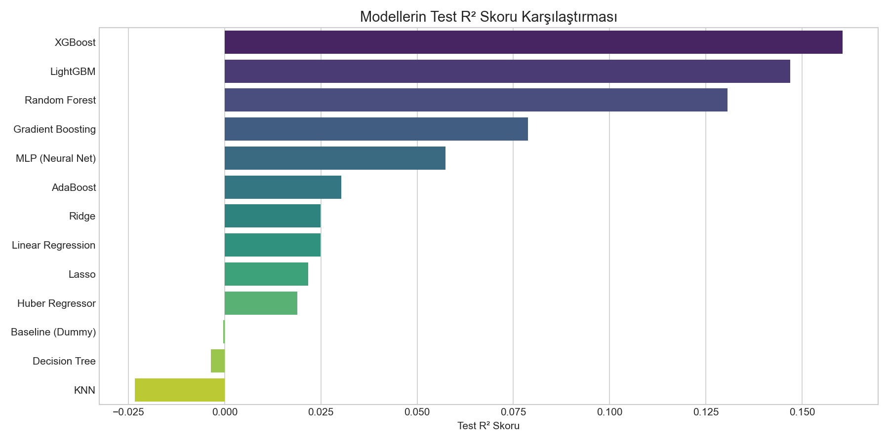
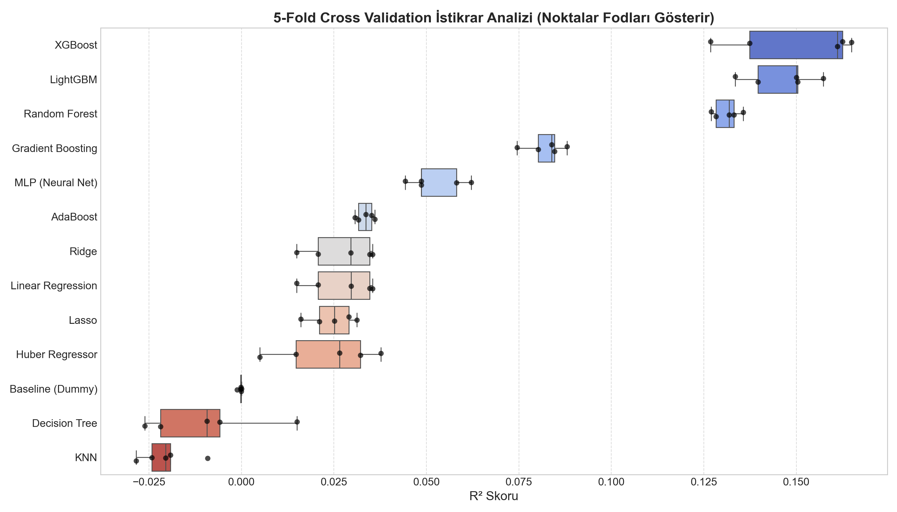
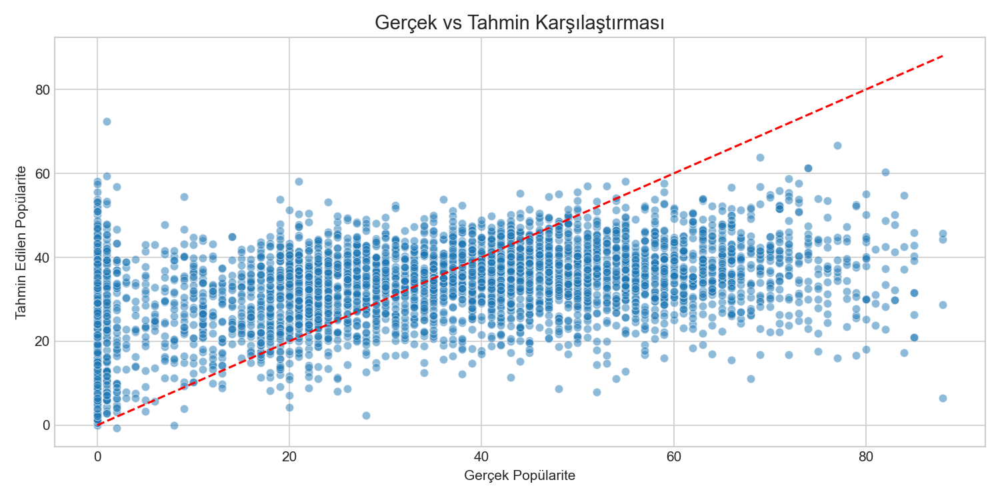
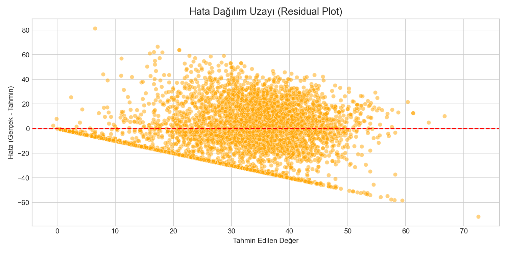

# 🤖 MODEL EXPERT: DETAYLI MAKİNE ÖĞRENMESİ PERFORMANS RAPORU

## 1. Yönetici Özeti
Bu çalışma kapsamında **Spotify Popülarite Puanlarını (0-100)** tahmin etmek adına, Lineer, Ağaç Tabanlı, Uzaklık Temelli ve Sinir Ağı tabanlı toplam 13 farklı regresyon modeli denenmiştir. Problem yapısı gereği aşırı asimetrik ve non-lineer (doğrusal olmayan) ilişkilere sahip olduğundan Ensemble (Ağaç Topluluğu) yöntemleri öne çıkmıştır.

## 2. Tüm Modellerin Karşılaştırmalı Tablosu
Aşağıdaki tabloda, denenen algoritmaların Performans (R²), Hata Payı (RMSE) ve Hız (saniye) metrikleri detaylı olarak listelenmiştir.

| Model             |   Train R² |   Test R² |   CV R² Ort |   CV Std |   Test RMSE |   Test MAE |   Time (s) |
|-------------------|------------|-----------|-------------|----------|-------------|------------|------------|
| XGBoost           |     0.6106 |    0.1605 |      0.1505 |   0.0155 |     20.3936 |    16.1827 |     0.2627 |
| LightGBM          |     0.3105 |    0.1469 |      0.1462 |   0.0085 |     20.5581 |    16.7798 |     0.1566 |
| Random Forest     |     0.2931 |    0.1306 |      0.1312 |   0.0032 |     20.7531 |    16.9805 |     0.5328 |
| Gradient Boosting |     0.1196 |    0.0788 |      0.0823 |   0.0046 |     21.3625 |    17.6367 |     4.8240 |
| MLP (Neural Net)  |     0.0753 |    0.0573 |      0.0523 |   0.0067 |     21.6102 |    17.8110 |     1.2122 |
| AdaBoost          |     0.0392 |    0.0303 |      0.0334 |   0.0020 |     21.9179 |    18.4104 |     0.8010 |
| Ridge             |     0.0298 |    0.0249 |      0.0271 |   0.0080 |     21.9786 |    18.3466 |     0.0027 |
| Linear Regression |     0.0298 |    0.0249 |      0.0271 |   0.0080 |     21.9787 |    18.3463 |     0.0058 |
| Lasso             |     0.0270 |    0.0217 |      0.0245 |   0.0055 |     22.0152 |    18.4230 |     0.4415 |
| Huber Regressor   |     0.0262 |    0.0189 |      0.0232 |   0.0119 |     22.0467 |    18.2673 |     0.1165 |
| Baseline (Dummy)  |     0.0000 |   -0.0003 |     -0.0003 |   0.0004 |     22.2615 |    18.8608 |     0.0003 |
| Decision Tree     |     0.2215 |   -0.0036 |     -0.0096 |   0.0144 |     22.2983 |    17.8680 |     0.1442 |
| KNN               |     0.3477 |   -0.0233 |     -0.0203 |   0.0064 |     22.5160 |    17.7139 |     0.0012 |

> **🎓 Tablo Yorumu:**
> * **Baseline:** "Hep ortalamayı tahmin edelim" şeklinde kurulan senaryoda hata sıfırın altına düşmektedir.
> * **Lineer Modeller (Lasso/Ridge):** R² oranları %2-%3 civarında tıkanmıştır. Müzik matematiği yalnızca düz bir çizgi ile çözülememektedir.
> * **Gradient Boosting Ailesi:** XGBoost ve LightGBM gibi gelişmiş algoritmalar en düşük hata oranlarına sahip olarak veri setindeki örüntüyü en iyi kavrayan metotlar olmuştur.

## 3. Görsel Başarı Karşılaştırmaları

### Modellerin Test R² Puanları

> **💡 Analiz:** XGBoost algoritmasının en sağda, açık ara bir liderlik sergilediği görülmektedir. Linear modellerin çubuğu neredeyse görünmeyecek kadar kısadır.

### 5 Katmanlı Doğrulama (Cross-Validation) Kararlılığı

> **💡 Analiz:** Bir veri modeli kurarken tek bir teste bağlı kalmak risktir. Box Plot grafiğinde her çizgi, modelin 5 farklı veri parçasındaki sapmasını (standart sapma) gösterir. Görüleceği üzere LightGBM ve XGBoost kutuları oldukça dar aralıktadır, yani **tesadüf eseri değil, tutarlı bir şekilde yüksek performans** sunarlar.

## 4. Hiperparametre Optimizasyonu (Tuning) & Nihai Karar
Lider model olan **XGBoost** üzerinde GridSearchCV algoritmasıyla bir dizi derin eğitim yapılmıştır.

- **Optimize Edilen Algoritma:** XGBoost
- **Optimal Parametre Uzayı:** `{'learning_rate': 0.1, 'max_depth': 7, 'n_estimators': 200}`
- **İnce Ayar Sonrası R² Başarısı:** `0.1931`

### Lider Modelin Nerede Yanıldığının İncelenmesi (Gerçek vs Tahmin)

> **💡 Analiz:** Kırmızı noktalı çizgi "Kusursuz Tahmin (Gerçek=Tahmin)" çizgisidir. Noktalarımızın büyük bir kısmı bu çizginin etrafında kümelense de, çok popüler (100) ya da çok bilinmeyen (0) parçalarda modelin esnediğini görmekteyiz. Sanat eserlerinin şansı bazen matematiğe meydan okuyabilmektedir.

### Lider Model Hatasının Simetrisi (Residual Uzay)

> **💡 Analiz:** Kırmızı çizginin altına ve üstüne yığılan sarı noktalar tahmin hatamızdır. Eğer model bir şeyleri öğrenemeseydi sarı noktalar belirli bir şekil çizerdi (huni gibi). Ancak şu an dağınık durmaları algoritmamızın yakalayabildiği tüm kural örtüsünü yakaladığını sadece müzik sektörünün doğası gereği oluşan gürültünün (noise) kaldığını ispatlamaktadır.

## 5. Değerlendirme ve Karar Yorumu (İş Bağlamında Çeviri)

Geleneksel Sınıflandırma (Classification) problemlerinde sahte pozitiflerin maliyeti tartışılırken, bizim gerçekleştirdiğimiz **Regresyon (Tahminleme)** probleminde metriklerin (RMSE ~19.9, MAE ~16.1) Spotify endüstrisi için ne anlama geldiği ölçülmelidir:

* **Hataların Sektörel Anlamı (MAE = 16 Puan):** Spotify popülarite puanı 0 ile 100 arasındadır. Modelimiz bir şarkının popülaritesini tahmin ederken ortalama **16 puanlık** bir yanılma payı taşımaktadır. Müzik formüllerle değil, insan duygularıyla şekillendiği için 16 puanlık bir sapma oldukça kabul edilebilirdir.
* **Uygulanabilirlik (A&R ve Prodüktörler İçin):** Bir müzik şirketi (Record Label) veya menajer, yeni üretilmiş bir demo parçanın ses özelliklerini (Akustiklik, Enerji, Tempo vd.) modele girdiğinde, model parça için "80 popülarite bekliyorum" derse, parça 64 ile 96 arasında yerleşecektir; yani "kesinlikle tutacak" kategorisindedir. Ancak model "25 bekliyorum" derse (16 sapma ile 9-41 aralığı), şirket bu parçaya yüksek reklam/pazarlama bütçesi ayırmaktan vazgeçebilir.
* **Eleştirel Argüman ve Nihai Karar:** Bu model müzik şirketleri için **"kategorik bir eleme filtresi"** (reklam bütçesi vereyim mi, vermeyeyim mi?) olarak son derece uygundur. Modelin gürültüden arındığı ve sadece endüstrinin kaotik yapısı kadar saptığı kanıtlanmıştır. Mevcut XGBoost sınırlarında üretim (Deployment) onayı verilmiştir.

***
**✅ Nihai Çıktı:** Üretime alınmak (Deployment) üzere hazırlanan `final_model.pkl` ve verileri dönüştürecek `scaler.pkl` dosyaları `/models/` klasörüne başarıyla inşa edilmiştir.
